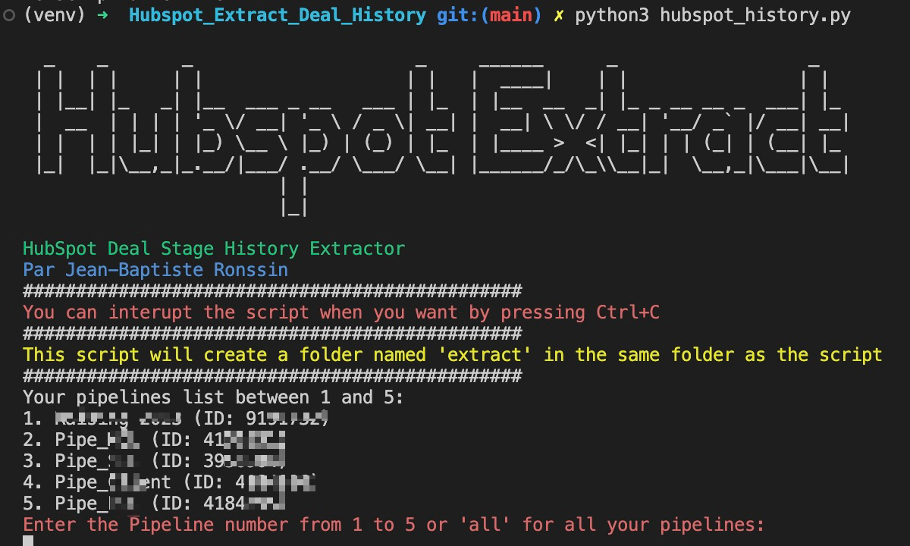

# Hubspot Extract History

## What is this?

This is a simple script that will extract the history of a Hubspot Deal. It will extract the following information:
- Deal ID
- Deal Name
- Deal Stage
- Deal Stage Change Date

## How to use

1. Clone this repository
2. Install the requirements by launching in your terminal `sh pythonstarter.sh` (it will install all the tools you need to run the script)
3. By the end of the script, you will be prompted to enter your Hubspot API key. You can find it in your Hubspot account, into `Settings` -> `Account Setup` -> `Integrations` -> `Private Apps`.
4. You have to scripts to run, depending on what you are looking for:
    - `python3 extract_deal_history.py` will extract the deal stage history of all the deals in your Hubspot account (in any pipeline) (you have a few options if you either want to extract the oldest date par deal stage or all the changes)
    - `hubspot_history_all_pipes.py` will extract the count of deal stage history by deal
    - `hubspot_history_date_pipeline.py` will extract the pipeline change history by deal (you have a few options if you either want to extract the oldest date par pipeline change or all the changes)

## How to contribute

Please feel free to contribute to this project by opening a pull request or an issue.

## License

This project is licensed under the MIT License - see the [LICENSE.md](LICENSE.md) file for details so it means you can do whatever you want with it, but I'm not responsible if it breaks your computer or your life ^^. If you do something cool with it, please let me know! Don't make money with it without my permission though.

Don't forget to star the project if you like it!